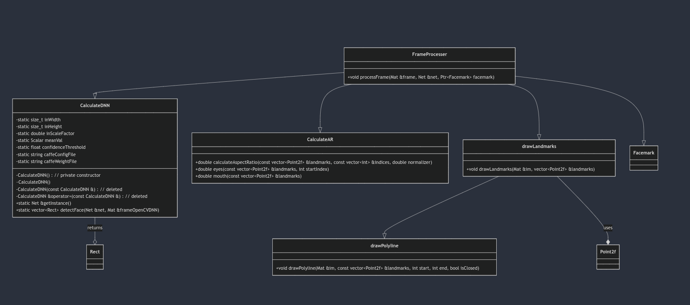

# Detecção e Análise Facial com OpenCV

## Visão Geral
Este projeto utiliza a poderosa biblioteca OpenCV para realizar detecção e análise facial em vídeos e imagens estáticas. Ele emprega uma rede neural convolucional (CNN) para detectar rostos e identificar landmarks faciais, proporcionando uma análise detalhada das expressões e características faciais. O objetivo principal do projeto é a validação da posição facial, um elemento crucial em sistemas de reconhecimento facial. Para garantir uma coleta de imagens eficaz e confiável, o sistema implementa um mecanismo de validação que assegura que certos padrões sejam respeitados durante a captura.

Este mecanismo de validação é especialmente relevante em aplicações onde a precisão da detecção facial é essencial, como em sistemas de segurança, autenticação biométrica, e interfaces de usuário baseadas em gestos. O projeto realiza cálculos de Aspect Ratio (proporção de aspecto) para identificar e monitorar estados faciais, como olhos abertos/fechados e boca aberta/fechada, oferecendo insights em tempo real sobre a expressão facial do usuário.

A escolha deste tema reflete a crescente importância dos sistemas baseados em Visão Computacional, especialmente na área de reconhecimento e detecção facial. Tais sistemas são fundamentais para o desenvolvimento de projetos interativos, proporcionando uma interação mais natural e intuitiva entre humanos e máquinas. A detecção facial não só melhora a segurança e a personalização em dispositivos tecnológicos, mas também abre novas possibilidades em áreas como entretenimento, saúde e educação, onde a análise facial pode ser utilizada para melhorar a experiência do usuário e oferecer soluções inovadoras.

## Funcionalidades Principais

1. **Detecção de Faces:**
   - Utiliza um modelo de rede neural (DNN) treinado para identificar rostos em um frame.
   - A detecção é baseada em um modelo Caffe com configurações e pesos pré-treinados.

2. **Identificação de Landmarks Faciais:**
   - Após a detecção do rosto, landmarks faciais são identificados usando o modelo LBF (Local Binary Features).

3. **Cálculo de Aspect Ratio (AR):**
   - **EAR (Eye Aspect Ratio):** Mede a abertura dos olhos para determinar se estão abertos ou fechados.
   - **MAR (Mouth Aspect Ratio):** Mede a abertura da boca para determinar se está aberta ou fechada.

4. **Visualização:**
   - Desenha retângulos ao redor dos rostos detectados.
   - Marcações dos landmarks faciais.
   - Exibe textos indicando o estado dos olhos e da boca.

## Estrutura do Código



### 1. **Classe `FrameProcesser`**
Responsável por processar cada frame da imagem ou vídeo.

- **Função `processFrame`:**
  - Reduz a resolução do frame para otimizar o processamento.
  - Converte o frame para escala de cinza e equaliza o histograma para melhorar a detecção.
  - Detecta rostos usando o modelo DNN.
  - Ajusta os landmarks faciais e calcula EAR e MAR.
  - Exibe o frame com as anotações visuais.

### 2. **Classe `CalculateDNN`**
Gerencia o modelo de rede neural para detecção facial.

- **Funções Principais:**
  - `getInstance`: Retorna a instância Singleton da rede neural.
  - `detectFace`: Detecta rostos no frame usando o modelo DNN.

### 3. **Classe `CalculateAR`**
Realiza os cálculos de Aspect Ratio para olhos e boca.

- **Funções Principais:**
  - `calculateAspectRatio`: Cálculo genérico do Aspect Ratio.
  - `eyes`: Cálculo do EAR.
  - `mouth`: Cálculo do MAR.

### 4. **Funções Auxiliares**
- **`drawPolyline` e `drawLandmarks`:** Desenham os landmarks faciais no frame.

### 5. **Função `main`**
Carrega o vídeo ou imagem, inicializa os componentes necessários e processa cada frame.

- **Fluxo Principal:**
  - Carrega o arquivo de entrada (vídeo ou imagem).
  - Inicializa o modelo DNN e o modelo de facemark.
  - Processa cada frame, chamando `processFrame`.
  - Exibe os resultados e aguarda uma tecla para sair.

## Utilização de Orientação a Objetos

O projeto aplica conceitos de Orientação a Objetos para encapsular as funcionalidades de detecção e processamento de faces em classes bem definidas. As principais classes incluem:

- **`FrameProcesser`**: Responsável pelo processamento de cada frame, incluindo a detecção de rostos, identificação de landmarks faciais e cálculo de métricas como EAR (Eye Aspect Ratio) e MAR (Mouth Aspect Ratio).
- **`CalculateDNN`**: Gerencia a carga e utilização do modelo de DNN para detecção facial. Utiliza o padrão Singleton para garantir que apenas uma instância da rede seja utilizada durante a execução.

Essas classes trabalham em conjunto para modularizar o código, permitindo fácil manutenção e expansão.

## Polimorfismo

O projeto utiliza polimorfismo para lidar com diferentes etapas do processamento de imagens de forma genérica:

- A classe `CalculateDNN` fornece uma interface para detectar faces em um frame, independentemente da origem ou formato do frame.
- A classe `CalculateAR` encapsula métodos específicos para cálculo de EAR e MAR, permitindo que diferentes partes do código chamem esses métodos sem se preocupar com os detalhes de implementação.

Esse uso de polimorfismo torna o código flexível e extensível. Por exemplo, novos métodos de detecção ou cálculos adicionais podem ser facilmente adicionados sem modificar a lógica principal do processamento de frames.

## Padrão de Projeto

O projeto incorpora o padrão de projeto **Singleton** na classe `CalculateDNN`. Esse padrão é utilizado para garantir que a rede neural seja carregada e utilizada de maneira eficiente, evitando múltiplas cargas do mesmo modelo e, assim, melhorando a performance.


## Como Executar

### Pré-requisitos
- OpenCV instalado com suporte para DNN e facemark.
- Arquivos de modelo para detecção facial (`deploy.prototxt` e `res10_300x300_ssd_iter_140000_fp16.caffemodel`).
- Modelo LBF para landmarks (`lbfmodel.yaml`).

### Comandos

- Para instalação, em distribuição como Ubuntu/Debian/Mint e derivados:
Ultilize o comando:
   ```bash
   sudo apt update
   sudo apt install -y g++ make cmake wget unzip libopencv-dev libgtk-3-dev libpng++-dev libpng16-16 libpng-dev
   wget -O opencv.zip https://github.com/opencv/opencv/archive/master.zip
   unzip opencv.zip
   mv opencv-master opencv
   mkdir -p build && cd build
   cmake ../opencv
   make
   sudo make install
   ```
- E para qualquer outra distro ou sistema operacional você pode clonar o repositório <https://github.com/opencv/opencv> e compilar, mas antes precisará instalar as dependências em tempo de compilação e em tempo de execução .

1. Compile o código:
   ```bash
     g++ -I/usr/include/opencv4 -g -o facial_analysis main.cpp -lopencv_core -lopencv_imgproc -lopencv_highgui -lopencv_imgcodecs -lopencv_videoio -lopencv_face -lopencv_objdetect -lopencv_dnn -std=c++11
   ```

2. Execute o programa:
   ```bash
   ./facial_analysis
   ```

## Personalização

- **Parâmetros Threshold:** Os valores de EAR e MAR podem ser ajustados na classe `FrameProcesser` para alterar os critérios de detecção de olhos fechados e boca aberta.
- **Adição de Parametros novos** Dentro da classe para calculo de AR, podem ser adicionados demais medições que se fizerem necessarias para a comprovação do sistema, como posição da cabeça.
- **Modelos Customizados:** Pode-se substituir os modelos de DNN e LBF por outros, conforme necessário.

## Possíveis Melhorias

1. **Melhor Gerenciamento de Erros:** Adicionar tratamento de exceções para falhas no carregamento de arquivos ou na execução de funções.
2. **Interface Gráfica Mais Rica:** Incluir gráficos ou outros elementos visuais para uma melhor representação dos resultados.
3. **Otimização de Performance:** Implementar técnicas de paralelização ou processamento em lote para melhorar o desempenho.
4. **Configuração Externa:** Permitir configuração dos parâmetros através de arquivos ou argumentos de linha de comando.

## Conclusão
Este projeto demonstra o uso de OpenCV para detecção e análise facial em tempo real. Com algumas melhorias e personalizações, ele pode ser expandido para aplicações em monitoramento de fadiga, segurança, ou interações baseadas em expressões faciais.

